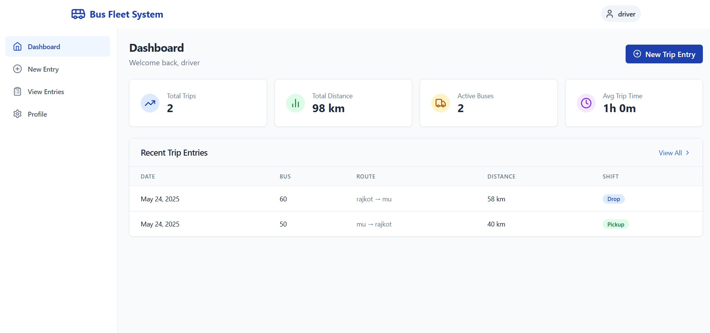
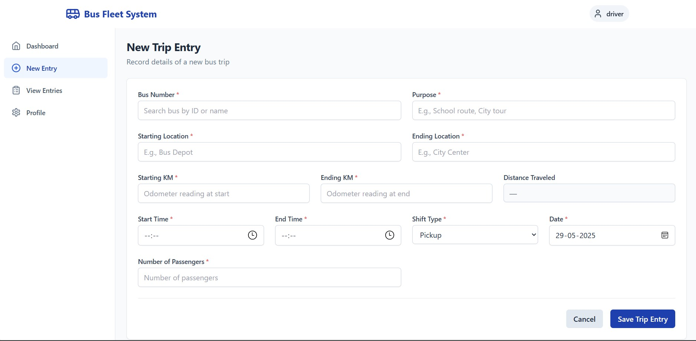
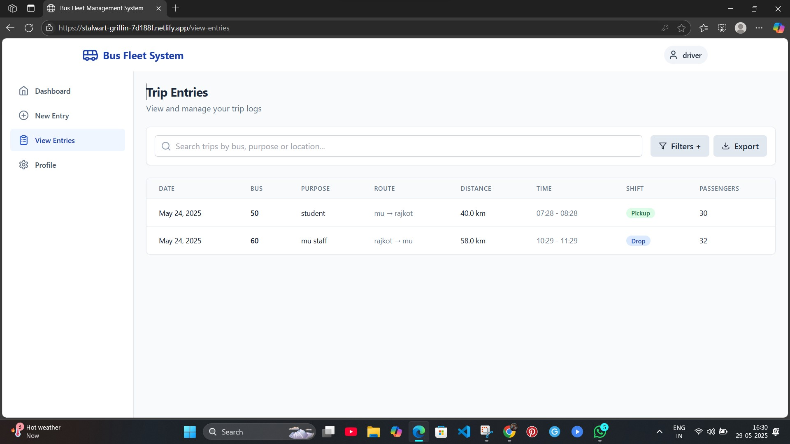

# 🚌 Bus Fleet Management System

A modern web application to manage bus fleet operations such as logging trips, managing buses, routes, passengers, and tracking distances. This app is designed for drivers and administrators to easily record and monitor bus operations.

🌐 [Live Demo](https://stalwart-griffin-7d188f.netlify.app/)

## 📸 Screenshots

### Dashboard
Displays overall summary: total trips, total distance, active buses, and average trip time.


### New Trip Entry
Form to log a new trip with all necessary details including purpose, locations, times, and passenger count.


### View Trip Entries
Searchable and filterable list of all trip logs, exportable as well.


## 🚀 Features

- User login (driver/admin)
- Dashboard summary (trips, distances, buses, avg time)
- Add new trip entries with validations
- View all entries with filtering and export
- Responsive UI with user-friendly design

## 🛠️ Tech Stack

| Tech          | Usage                            |
|---------------|----------------------------------|
| **Frontend**  | React + TypeScript               |
| **Styling**   | Tailwind CSS                     |
| **State Mgmt**| Redux / React Context (if used)  |
| **Backend**   | PostgreSQL via Supabase          |
| **Deployment**| Netlify                          |

> Tech Stack Breakdown:
- **TypeScript** (87.6%)
- **PLpgSQL** (5.4%)
- **JavaScript** (3.5%)
- **CSS** (2.9%)
- **HTML** (0.6%)


## ⚙️ Setup Instructions

### 1. Clone the repository

```bash
git clone https://github.com/prafulla2121/Bus-fleet-managemant.git
cd Bus-fleet-managemant

npm install
# or
yarn install

VITE_SUPABASE_URL=your-supabase-url
VITE_SUPABASE_ANON_KEY=your-supabase-anon-key


